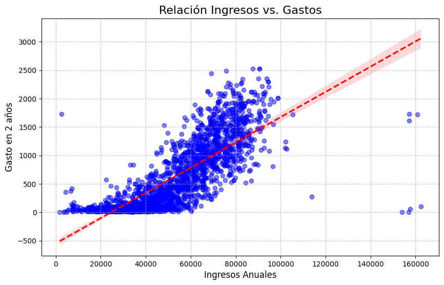
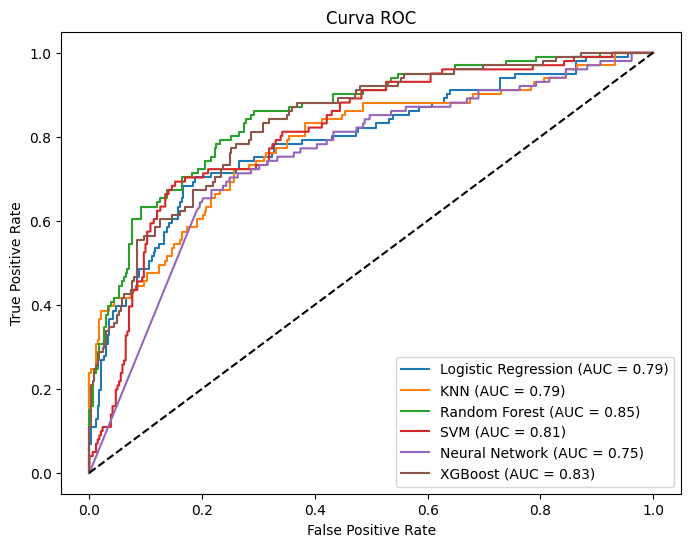
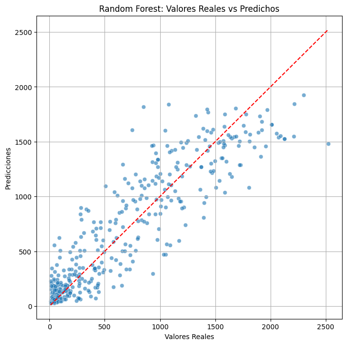

# 📊 **Marketing ML: Customer Personality Analysis**  
**Machine Learning aplicado a Marketing** (Classification, Regression y próximamente Clustering)  

  

## 📌 **Descripción del Proyecto**  
Este repositorio contiene un **análisis de datos y modelos predictivos** basados en el dataset **[Customer Personality Analysis de Kaggle](https://www.kaggle.com/datasets/imakash3011/customer-personality-analysis/)**. El objetivo es predecir comportamientos de clientes (como respuesta a campañas o gasto) usando:  
- **🔵 Classification**: ¿El cliente aceptará una futura oferta?  
- **🔴 Regression**: ¿Cuánto gastará el cliente en el negocio conociendo sus datos personales?  
- **🟢 (En progreso) Clustering**: Segmentación de clientes por comportamiento.  

---

## 📂 **Estructura del Repositorio**  
```
marketing_ml_classification_regression_clustering/  
├── app/  
│   ├── classification/  
│   │   └── 01_classification_model.py  # App Streamlit (Modelo de Clasificación)  
│   ├── regression/  
│   │   └── 02_regression_model.py      # App Streamlit (Modelo de Regresión)  
│   └── assets/                         # Carpeta para imágenes (gráficos, esquemas)   
├── notebooks/  
│   ├── 01_Data_Exploration.ipynb      # Análisis exploratorio (EDA)  
│   ├── 02_Classification_Model.ipynb  # Entrenamiento del modelo de clasificación  
│   └── 03_Regression_Model.ipynb      # Entrenamiento del modelo de regresión  
├── assets/                            # Imágenes globales (banner, diagramas)   
│   ├── banner.png  
│   ├── eda_income_vs_spent.png  
│   ├── curva_roc.png
│   └── real_vs_predicho.png  
└── README.md  
```

---

## 🧠 **Análisis y Modelos**  

### 1. **Exploración de Datos (EDA)**  
*Análisis de características clave como ingresos, gastos, educación, etc.*  
 

**Hallazgos clave**:  
- Relación entre **gasto en vino** y **nivel educativo**.  
- Clientes con hijos tienden a responder menos a campañas.  

---

### 2. **Modelo de Clasificación**  
**Objetivo**: Predecir si un cliente aceptará una campaña de marketing.  Predice qué clientes aceptarán campañas de marketing. Optimiza recursos y aumenta la tasa de conversión con decisiones basadas en datos
- **Algoritmo ganador**: Random Forest (Accuracy: 84.2%).  
- **Variables clave**: Gasto total y en 2 productos en particular, Compras online y por catálogo, Ingresos, Número de hijos.  

```python
# Ejemplo de código en Streamlit (app/classification/)
st.write("Probabilidad de aceptación: ", model.predict_proba(input_data)[0][1])
```

 

[](https://marketingmlclassificationregressionclustering-2apkcvnbir7q4iuc.streamlit.app) 

---

### 3. **Modelo de Regresión**  
**Objetivo**: Predecir el gasto total de un cliente en los próximos 2 años en el negocio.  
- **Algoritmo ganador**: Random Forest (R² Score: 0.8214).  
- **Variables clave**: Ingresos, Antigüedad como cliente, Edad, Hijos y Nivel de estudios.  

```python
# Ejemplo en Streamlit (app/regression/)
st.metric("Gasto predicho", f"${prediction[0]:.2f}")
```

 

[](https://funkykespain-marketing--appregression02-regression-model-rjzlvk.streamlit.app) 

---

### 4. **Próximos Pasos: Clustering**  
**Objetivo**: Segmentar clientes en grupos con comportamientos similares.  
- **Dataset**: El mismo ([Kaggle](https://www.kaggle.com/datasets/imakash3011/customer-personality-analysis/)).  
- **Técnicas a probar**: K-Means, DBSCAN...
- **Variables candidatas**: Todas las usadas en classification/regression.   

---

## 🚀 **Cómo Ejecutar el Proyecto**  
1. **Apps Streamlit**:  
   ```bash
   streamlit run app/classification/01_classification_model.py
   streamlit run app/regression/02_regression_model.py
   ```  
2. **Notebooks**: Abrir en Jupyter o Google Colab.  

---

## 🌟 **Conclusión**  
Este proyecto demuestra cómo **el Machine Learning puede optimizar estrategias de marketing**, desde predecir respuestas hasta segmentar clientes. ¡Próximamente: clustering!  

**¿Preguntas?** ¡Abre un *issue* o contáctame!  

--- 

### 🔗 **Enlaces**  
- [Dataset en Kaggle](https://www.kaggle.com/datasets/imakash3011/customer-personality-analysis/)  
- [Repositorio](https://github.com/funkykespain/marketing_ml_classification_regression_clustering/)  
- [Predicción de Aceptación de Campañas de Marketing](https://marketingmlclassificationregressionclustering-2apkcvnbir7q4iuc.streamlit.app/) 
- [Predicción de Gasto de Clientes](https://funkykespain-marketing--appregression02-regression-model-rjzlvk.streamlit.app/) 

--- 

✨ **¡Si te gusta el proyecto, déjale una ⭐!**  

--------

<p><small>Project based on the <a target="_blank" href="https://drivendata.github.io/cookiecutter-data-science/">cookiecutter data science project template</a>. #cookiecutterdatascience</small></p>
